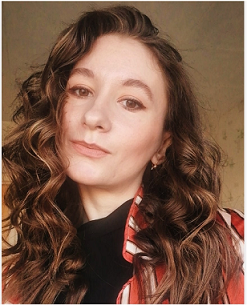

**rsschool-cv** 
-----
**Natallia Siniak**

-----
**Contacts:**
* **Phone:** +995-591058394
* **E-mail:** natalia.vasilevna.s@gmail.com
* **Discord:** Natallia Siniak
* **GitHub:** NatalliaSNV
-----
**About Me**  
I am 25. For the last two years I have been working as an physicist-algorithmist in the laboratory of the State University of Informatics and Radioelectronics. In my position I reached the maximum, besides I realized that I want to try myself in another sphere. My choice fell on the profession of a front-end developer. In my opinion, I am suitable for this profession, and it suits me. I have an analytical mindset, well trained, purposeful, attentive.I have experience of working in a team. I also have programming and software development experiences.
-----
**Skills:**
* C++, Python (basic)
* HTML (basic), CSS (basic)
* Experience in writting Unit-tests
-----
**Code example:**
'''
#include <math.h>

double square_area(double A) {
  // to do
  
  double r = 2 * A / M_PI;
  double area = pow(r,2);
  double result = round (area*100)/100;
  return result;
};
'''
-----
**Experience**
* Sep. 2016 - Dec.2019 - a tutor in physics and mathematics (while studying at the university).
* Jan. 2020- Apr. 2022 - an physicist-algorithmist in the laboratory of the Belarusian State University of Informatics and Radioelectronics.
* My project: https://snvhtml.w3spaces.com/. I did it for my practice.
------
**Education:**
* **University:** 2014 - 2020 - the Belarusian State University, Faculty of Physics.
Specialty: Nuclear physics and technology.
* **Courses:** [Веб-Верстальщик: Начало от WAYUP](https://wayup.in/library/course6?utm_source=google&utm_medium=cpc&utm_campaign=VS_Performance_Max_SNG&utm_term=_&utm_content=__c&gclid=CjwKCAjw7vuUBhBUEiwAEdu2pLGtmlLGCnJDZFeKb1042iv8f_6sMQXaInJBe-UlI-w0gUgA0g9aEhoC02gQAvD_BwE "Ссылка на курс")
-----
**English**  
A2 (B1 in progress)